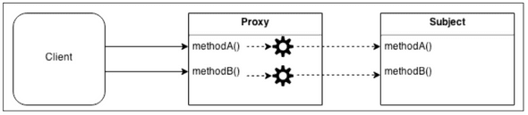
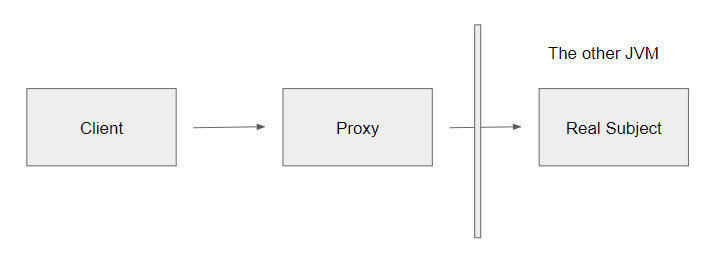
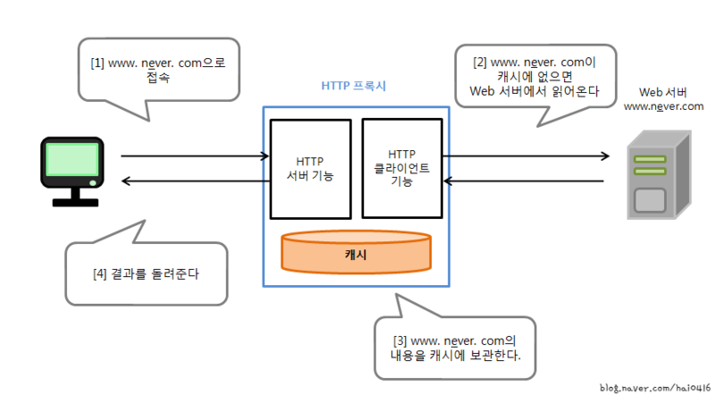

# 트랜잭션 이해를 위한 배경 공부

## 1. AOP 개념

### 1) 정의

스프링 프레임워크에서 AOP(Aspect-Oriented Programming, 관점 지향 프로그래밍)는 프로그래밍의 한 패러다임으로, 애플리케이션의 공통 관심 사항(Cross-Cutting Concerns)을 모듈화하는 방법을 뜻한다.

애플리케이션 공통 사항이라 함은 로깅, 트랜잭션 관리, 보안 등과 같은, **애플리케이션의 모든 비즈니스 기능에 공통적으로 적용**되는 부분을 말한다. 

### 2) 프록시 패턴

스프링 프레임워크에서 AOP는 프록시 패턴을 활용해서 구현된다.

프록시 패턴은 대상 원본 객체를 대리하여 대신 처리하게 함으로써 로직의 흐름을 제어하는 행동 패턴이다. 객체지향 프로그래밍에서 클라이언트가 직접 대상 객체를 활용하지 않고 **대리인 객체**를 거쳐서 추가 로직을 수행하고 그제야 대상 객체에 접근하게 된다.



프록시 패턴이 필요한 예시로는 아래와 같다.

>- 보안(Security) : 프록시는 클라이언트가 작업을 수행할 수 있는 권한이 있는지 확인하고 검사 결과가 긍정적인 경우에만 요청을 대상으로 전달한다.
>- 캐싱(Caching) : 프록시가 내부 캐시를 유지하여 데이터가 캐시에 아직 존재하지 않는 경우에만 대상에서 작업이 실행되도록 한다.
>- 데이터 유효성 검사(Data validation) : 프록시가 입력을 대상으로 전달하기 전에 유효성을 검사한다.
>- 지연 초기화(Lazy initialization) : 대상의 생성 비용이 비싸다면 프록시는 그것을 필요로 할때까지 연기할 수 있다.
>- 로깅(Logging) : 프록시는 메소드 호출과 상대 매개 변수를 인터셉트하고 이를 기록한다.
>- 원격 객체(Remote objects) : 프록시는 원격 위치에 있는 객체를 가져와서 로컬처럼 보이게 할 수 있다

스프링 JPA에 있는 개념 중 하나인 지연 로딩이 바로 프록시 패턴의 예시인 **지연 초기화**를 구현 활용한 예시다. 또한 JPA에서 1차 캐시와 2차 캐시를 활용할 때 프록시 패턴과 유사한 매커니즘이 작동한다.

```java
interface ISubject {
    void action();
}

class RealSubject implements ISubject {
    @Override
    public void action() {
        System.out.println("원본 객체 액션");
    }
}
```

아래서 설명할 예시 코드를 위한 공통 코드로 프록시 객체와 원본 객체의 공통 상위 인터페이스(`ISubject`)와 실제 원본 객체(`RealSubject`)는 위와 같다.

#### (1) 기본 프록시 패턴

```java
class Proxy implements ISubject {
    private RealSubject realSubject;

    public Proxy(RealSubject realSubject) {
        this.realSubject = realSubject;
    }

    @Override
    public void action() {
        realSubject.action();
        System.out.println("프록시 객체 액션");
    }
}

class Client {
    public static void main(String[] args) {
        ISubject subject = new Proxy(new RealSubject());
        subject.action();
    }
}
```

- 프록시 객체(`Proxy`)와 대상 객체(`RealSubject`)를 공통 인터페이스(`ISubject`) 기반으로 클라이언트가 프록시와 대상을 동일한 방식으로 사용
- 프록시가 대상을 감쌈으로써 클라이언트(`Client`)가 직접 대상 객체에 접근하는 것을 방지하고 추가 로직(유효성 검증, 캐싱 등)을 프록시에 구현할 수 있음

#### (2) 가상 프록시 패턴

```java
class Proxy implements ISubject {
    private RealSubject subject;

    Proxy() {
    }

    @Override
    public void action() {
        // 클라이언트가 호출한 메소드를 가로채고, 먼저 추가 작업을 할 수 있음
        System.out.println("프록시에서 메소드 호출 전 처리(클라이언트로부터 메소드를 가로챔)");

        // 프록시 객체는 실제 요청(action(메소드 호출))이 들어 왔을 때 실제 객체를 생성
        if(subject == null){
            subject = new RealSubject();
        }
        subject.action(); // 위임

        // 실제 로직
        System.out.println("프록시 객체 액션");
    }
}

class Client {
    public static void main(String[] args) {
        ISubject subject = new Proxy();
        subject.action();
    }
}
```

- 원본이 되는 대상(`RealSubject`)의 생성 비용이 크거나 무거운 리소스를 사용하는 작업이 포함될 때 사용하는 패턴
- 원본 객체의 **지연 초기화**를 지원
- 즉, 프록시(`Proxy`)가 원본 객체를 참조하여 생성을 제어
- 기본 프록시에서는 프록시의 생성자에서 동시에 원본 객체도 생성이 이뤄졌는데, 가상 프록시는 생성이 됐다고 원본 객체가 생성되지 않음. **차후에 클라이언트가 프록시의 메소드 호출 시점에서 그제야 원본 객체가 생성되므로 지연 초기화 실현**
- 객체 생성을 미루는 것 역시 프록시가 클라이언트로부터 메소드를 가로챔(클라이언트의 요청이 프록시 객체를 먼저 거침)

#### (3) 보호 프록시 패턴

```java
class Proxy implements ISubject {
    private RealSubject subject; // 대상 객체를 composition
    boolean access; // 접근 권한

    Proxy(RealSubject subject, boolean access) {
        this.subject = subject;
        this.access = access;
    }

    public void action() {
        if (access) {
            subject.action(); // 위임
            System.out.println("프록시 객체 액션");
        } else {
            System.out.println("접근 권한 없음");
        }
    }
}

class Client1 {
    public static void main(String[] args) {
        ISubject subject = new Proxy(new RealSubject(), false);
        subject.action();
    }
}

class Client2 {
    public static void main(String[] args) {
        ISubject subject = new Proxy(new RealSubject(), true);
        subject.action();
    }
}
```

- 프록시가 원본 객체에 대하여 접근을 제어함으로써 특정 클라이언만 서비스 객체 접근 가능
- 클라이언트의 자격 증명에 따라 요청 전달 가능

#### (4) 로깅 프록시 패턴

```java
class Proxy implements ISubject {
    private RealSubject subject;

    Proxy(RealSubject subject) {
        this.subject = subject;
    }

    public void action() {
        System.out.println("로깅..................");

        subject.action(); // 위임

        // 로깅 이외의 추가 프록시 로직
        System.out.println("프록시 객체 액션");

        System.out.println("로깅..................");
    }
}

class Client {
    public static void main(String[] args) {
        ISubject sub = new Proxy(new RealSubject());
        sub.action();
    }
}
```

- 대상 객체(`RealSubject`)에 로깅을 추가
- 프록시의 로깅 기능은 대상 객체의 기능에 로깅을 추가하면서 재정의

#### (5) 원격 프록시



- 여기서 말하는 원격은, **네트워크를 통해 다른 시스템에 위치**함을 의미
- 즉, 네트워크를 통해 다른 시스템에 위치한 객체에 접근할 수 있도록 클라이언트와 객체 간의 프록시 역할을 하는 구조
- 클라이언트가 네트워크를 통해 원격 호출을 수행하는 복잡성을 숨겨서 흡사 로컬에서 호출하는 것처럼 보이게 함
- 프록시의 역할은 **네트워크 연결, 요청-응답의 직렬화/역직렬화**를 담당
- 멀리 갈 것 없이 JDBC 드라이버가 클라이언트와 DB(원본 객체)와의 연결의 프록시 역할을 맡음

#### (6) 캐싱 프록시



- 동일한 요청이 반복해서 들어올 때, 해당 데이터를 캐싱하여 반환하면서 네트워크 요청 비용 절감
- 클라이언트는 캐싱 데이터를 가지고 왔는지, 직접 데이터를 가지고 왔는지 알 필요가 없음
- 대표적인 예시가 Nginx, Spring Cache, Redis 캐시

### 3) 리플렉션 활용법 예제

```java
package reflection;

class Person {
    public String name; // public 필드
    private int age; // private 필드

    public static int height = 180; // static 필드

    // 이름, 나이를 입력받는 생성자
    public Person(String name, int age) {
        this.name = name;
        this.age = age;
    }

    // 기본 생성자
    public Person() {
    }

    public void getField() {
        System.out.printf("이름 : %s, 나이 : %d\n", name, age);
    }

    // public 메소드
    public int sum(int left, int right) {
        return left + right;
    }

    // static 메소드
    public static int staticSum(int left, int right) {
        return left + right;
    }

    // private 메소드
    private int privateSum(int left, int right) {
        return left + right;
    }
}
```

```java
package reflection;

import java.lang.reflect.Constructor;
import java.lang.reflect.Field;
import java.lang.reflect.InvocationTargetException;
import java.lang.reflect.Method;

public class Main {
    public static void main(String[] args)
            throws ClassNotFoundException, NoSuchMethodException, InvocationTargetException, InstantiationException, IllegalAccessException, NoSuchFieldException {
        // 클래스 객체 가져오기 (forName 메소드 방식)
        Class<Person> personClass = (Class<Person>) Class.forName("reflection.Person");

        // 생성자 가져오기 - Person(String name, int age)
        Constructor<Person> constructor = personClass.getConstructor(String.class, int.class); // getConstructor 인자로 생성자의 매개변수 타입을 바인딩 해주어야 한다.

        // 가져온 생성자로 인스턴스 만들기
        Person person = constructor.newInstance("홍길동", 55);
        person.getField(); // 이름 : 홍길동, 나이 : 55

        // 특정 public 메서드 가져와 실행
        // getMethod("메서드명", 매개변수타입들)
        Method sum = personClass.getMethod("sum", int.class, int.class);
        int result = (int) sum.invoke(new Person(), 10, 20);
        System.out.println("result = " + result); // 30


        // 특정 static 메서드 가져와 실행
        Method staticSum = personClass.getMethod("staticSum", int.class, int.class);
        int staticResult = (int) staticSum.invoke(null, 100, 200);
        System.out.println("staticResult = " + staticResult); // 300


        // 특정 private 메서드 가져와 실행
        Method privateSum = personClass.getDeclaredMethod("privateSum", int.class, int.class);
        privateSum.setAccessible(true); // private 이기 때문에 외부에서 access 할 수 있도록 설정
        int privateResult = (int) privateSum.invoke(new Person(), 1000, 2000);
        System.out.println("privateResult = " + privateResult); // 3000


        // static 필드를 가져와 조작하고 출력하기
        Field height_field = personClass.getField("height");
        System.out.println("정적 필드 변경 전: " + height_field.get(null));
        height_field.set(null, 200);
        System.out.println("정적 필드 변경 후: " + height_field.get(null));

        // public 필드를 가져온다.
        Field name_field = personClass.getField("name");

        // private 필드를 가져온다.
        Field age_field = personClass.getDeclaredField("age");
        age_field.setAccessible(true); // private 이기 때문에 외부에서 access 할 수 있도록 설정

        // 필드 조작하기
        name_field.set(person, "임꺽정");
        age_field.set(person, 88);

        System.out.println(name_field.get(person)); // 임꺽정
        System.out.println(age_field.get(person)); // 200
    }
}
```

- 자바 리플렉션의 핵심은 **런타임** 과정에서 클래스, 메소드, 필드, 생성자 등의 구조를 분석하고 조작
- `java.lang.reflect` 패키지에 클래스 구조를 나타내는 `Class`, 메소드를 조작하는 `Method`, 필드를 조작하는 `Field`, 생성자를 다루는 `Constructor` 등의 클래스가 포함됨
- 클래스 메타데이터(이름, 필드, 메소드 등) 분석 및 접근 제어, 런타임 객체 생성과 런타임 메소드 호출 및 필드 값 조작이 가능
- `Field` 클래스의 `setAccessible(boolean b)` 메소드를 활용하여 JVM 내부에 저장된 클래스 메타데이터의 접근 제어 검증을 무시하고 `private` 필드 조작을 할 수 있음
- 예전에는 `SecurityManager`를 통해 이를 비활성화 가능했으나 지금은 `SecuriyManager`가 deprecated 처리됨

### 4) 동적 프록시 패턴

컴파일 시점에 생성되는 다른 객체들과 다르게, 동적 프록시 패턴은 **런타임에 동적으로 프록시 객체를 생성**해서 원본 객체에 접근하거나 특정 로직을 위임하게 된다. 런타임 동작을 기반으로 하기 때문에 **리플레션**과 **인터페이스**가 핵심 기반이 된다.

자바에서는 `java.lang.reflect.Proxy` 클래스를 활용해서 동적 프록시 패턴을 구현할 수 있다. 런타임에 메소드 호출을 캡처하고 처리하면서 추가적인 동작을 담당하기 위해 리플렉션이 활용되며, 원본 객체와 프록시 객체는 동일 인터페이스를 기반으로 구현하면서 메소드 가로챔을 실현한다.

예제 코드를 통해 동적 프록시를 구현해보자.

```java
package proxy.dynamic;

public interface Animal {
    void eat();
}

// 프록시를 적용할 타겟 객체
class Tiger implements Animal{
    @Override
    public void eat() {
        System.out.println("호랑이가 음식을 먹습니다.");
    }
}
```
위처럼 프록시와 대상 객체가 공유할 인터페이스 `Animal`이 작성됐고, 대상 객체인 `Tiger` 내부에 `eat()` 메소드가 오버라이딩 구현되어 있다.

```java
package proxy.dynamic;

import java.lang.reflect.*;

public class Client {
    public static void main(String[] arguments) {

        // newProxyInstance() 메서드로 동적으로 프록시 객체를 생성할 수 있다.
        // 프록시 핸들러
        Animal tigerProxy = (Animal) Proxy.newProxyInstance(
                // Animal 인터페이스의 클래스 로더를 사용해 동적 프록시 객체를 생성
                Animal.class.getClassLoader(), // 대상 객체의 인터페이스의 클래스로더
                // 동적 프록시는 지정된 인터페이스 목록을 구현하는 익명 클래스
                new Class[]{Animal.class}, // 대상 객체의 인터페이스
                // 모든 메서드 호출은 InvocationHandler의 invoke 메서드로 전달
                /**
                 * proxy: 동적 프록시 객체 자신 (사용하지 않는 경우가 많음).
                 * method: 호출된 메서드의 메타정보 (Method 객체).
                 * args: 메서드에 전달된 인자들 (null일 수도 있음).
                 */
                (proxy, method, args) -> { // InvocationHandler 인터페이스 기반 람다 함수
                    Object target = new Tiger();

                    System.out.println("----eat 메서드 호출 전----"); // 호출 전의 원하는 동작(로킹)

                    Object result = method.invoke(target, args); // 타겟 메소드 호출

                    System.out.println("----eat 메서드 호출 후----"); // 호출 후의 원하는 동작(로킹)

                    return result; // 타겟 메소드 반환값 전달
                }
        );

        // 원하는 시점에 메소드 호출을 가로챈다.
        tigerProxy.eat();
    }
}
```

동적 프록시는 위에서 언급했듯, 런타임 시점의 객체 생성이 전제가 되기 때문에 자바의 장점인 컴파일 시점의 객체 생성을 포기하게 됨으로써 성능 저하는 분명히 존재할 수 있다. 그럼에도 어떤 장점이 존재하길래 활용되는 걸까.

#### (1) 캡슐화를 통한 중복 로직 제거

현재 구현체 `eat()` 메소드의 결과를 나타내기 전후로 **로킹**을 추가하고 있다. 만약 인터페이스 구현체가 늘어나게 된다 해도(`Lion`, `Eagle` 등등..) **공통 관심사**(현재 예제에서는 로깅이지만, 트랜잭션, 인증 등)를 캡슐화함으로써 중복을 줄일 수 있다. 이를 통해 `InvocationHandler`를 재사용할 수 있다.

#### (2) 호출 전후의 동작 동적 변경

유지보수 과정에서 기존의 대상 객체인 `Tiger`와 관련된 로직을 건드리지 않고 호출 전후의 동작을 변경하거나 추가, 삭제할 수 있다. 이는 객체지향에서의 **개방 폐쇄 원칙**을 준수하는 코드 설계다.

#### (3) 런타임에 유연한 동작 변경, 의존성 주입

`target` 변수에 담긴 대상 객체를 런타임에 동적으로 변경할 수 있게 된다. 즉, `new Tiger()` 대신 `new Lion()` 등을 넣어도 괜찮다. 또한 인터페이스 기반 설계여서 **의존성 주입**과도 잘 어울릴 수 있다.

즉, 동적 프록시 패턴이 자주 활용되는 이유는 아래와 같다.

>1. 추가되는 구현체에도 동일 로직 재사용 가능(중복 배제)
>2. 프록시 클래스를 별도 정의함으로써 서비스 호출 횟수에 따른 프록시 호출 횟수를 1번으로 줄임
>3. 대상 객체들의 인터페이스가 확장돼도 동적 프록시 리플렉션은 영향을 받지 않음
>4. AOP 구현에 적합
>5. 컴파일 시점에 모르는 객체에 대한 대응 가능(ex: JPA의 지연 로딩으로 컴파일 때는 프록시나, getter 등이 동작할 때 환산되는 실제 객체 타입 결정)

## 2. 스프링 AOP

### 1) 어드바이스, 포인트컷

### 2) MethodInterceptor 구현체 기반 AOP 어드바이스

### 3) @Around 어노테이션 기반 AOP 어드바이스

### 4) 적용 결과 확인