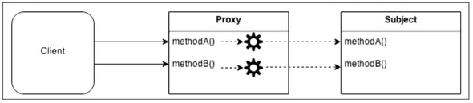

# 트랜잭션 이해를 위한 배경 공부

## 1. AOP

### 1) 정의

스프링 프레임워크에서 AOP(Aspect-Oriented Programming, 관점 지향 프로그래밍)는 프로그래밍의 한 패러다임으로, 애플리케이션의 공통 관심 사항(Cross-Cutting Concerns)을 모듈화하는 방법을 뜻한다.

애플리케이션 공통 사항이라 함은 로깅, 트랜잭션 관리, 보안 등과 같은, **애플리케이션의 모든 비즈니스 기능에 공통적으로 적용**되는 부분을 말한다. 

### 2) 프록시 패턴

스프링 프레임워크에서 AOP는 프록시 패턴을 활용해서 구현된다.

프록시 패턴은 대상 원본 객체를 대리하여 대신 처리하게 함으로써 로직의 흐름을 제어하는 행동 패턴이다. 객체지향 프로그래밍에서 클라이언트가 직접 대상 객체를 활용하지 않고 **대리인 객체**를 거쳐서 추가 로직을 수행하고 그제야 대상 객체에 접근하게 된다.



프록시 패턴이 필요한 예시로는 아래와 같다.

>- 보안(Security) : 프록시는 클라이언트가 작업을 수행할 수 있는 권한이 있는지 확인하고 검사 결과가 긍정적인 경우에만 요청을 대상으로 전달한다.
>- 캐싱(Caching) : 프록시가 내부 캐시를 유지하여 데이터가 캐시에 아직 존재하지 않는 경우에만 대상에서 작업이 실행되도록 한다.
>- 데이터 유효성 검사(Data validation) : 프록시가 입력을 대상으로 전달하기 전에 유효성을 검사한다.
>- 지연 초기화(Lazy initialization) : 대상의 생성 비용이 비싸다면 프록시는 그것을 필요로 할때까지 연기할 수 있다.
>- 로깅(Logging) : 프록시는 메소드 호출과 상대 매개 변수를 인터셉트하고 이를 기록한다.
>- 원격 객체(Remote objects) : 프록시는 원격 위치에 있는 객체를 가져와서 로컬처럼 보이게 할 수 있다

스프링 JPA에 있는 개념 중 하나인 지연 로딩이 바로 프록시 패턴의 예시인 **지연 초기화**를 구현 활용한 예시다. 또한 JPA에서 1차 캐시와 2차 캐시를 활용할 때 프록시 패턴과 유사한 매커니즘이 작동한다.

#### (1) 기본 프록시 패턴

```java
interface ISubject {
    void action();
}

class RealSubject implements ISubject {
    @Override
    public void action() {
        System.out.println("원본 객체 액션");
    }
}

class Proxy implements ISubject {
    private RealSubject realSubject;

    public Proxy(RealSubject realSubject) {
        this.realSubject = realSubject;
    }

    @Override
    public void action() {
        realSubject.action();
        System.out.println("프록시 객체 액션");
    }
}

class Client {
    public static void main(String[] args) {
        ISubject subject = new Proxy(new RealSubject());
        subject.action();
    }
}
```

- 프록시 객체(`Proxy`)와 대상 객체(`RealSubject`)를 공통 인터페이스(`ISubject`) 기반으로 클라이언트가 프록시와 대상을 동일한 방식으로 사용
- 프록시가 대상을 감쌈으로써 클라이언트(`Client`)가 직접 대상 객체에 접근하는 것을 방지하고 추가 로직(유효성 검증, 캐싱 등)을 프록시에 구현할 수 있음

---

# 커스텀 객체 풀 아이디어

## 1. 계기

문자열은 리터럴을 통해 메모리 최적화를 한다. 이는, 동일 내용을 가진 문자열 객체를 굳이 새롭게 생성하지 않고 이전 값 주소를 똑같이 참조하게 하는 것이다. 어차피 객체 해시코드, 주소 등이 달라져도 내부 내용만 같으면 사용자는 쓰기 편할 테니

뭔가 이 아이디어를 JPA의 영속성 컨텍스트에서 활용할 수 있지 않을까 싶었다. 단일 트랜잭션 내에서는 영속성 컨텍스트의 캐싱을 통해 동일 엔티티를 계속 사용하게 된다. 하지만 다음 트랜잭션은 새로운 영속성 컨텍스트가 생겨나기 떄문에 새로운 객체를 쓰게 된다. 이 과정에서 이전의 트랜잭션 때 생성된 객체가 빠르게 지워지리라는 보장이 없다. 가비지 컬렉터를 개발자가 제어할 수 없으므로.

그래서 문자열 풀처럼 커스텀 객체 풀을 활용해 다음 트랜잭션에서도 이전 트랜잭션 때 조회한 엔티티 객체 주소를 다시 재사용할 수 있는 방법을 구현(까진 못해도 아이디어 구상)해볼까 생각 중.

## 2. How

일단 영속성 컨텍스트와 트랜잭션을 깊게 공부해야 하지 않을까